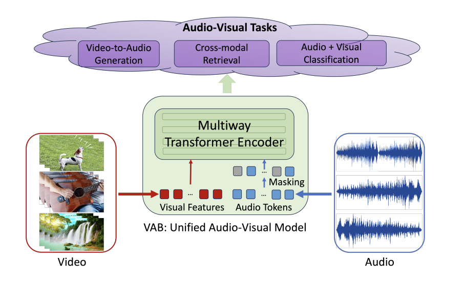

# Vision-to-Audio-and-Beyond
ICML 2024 paper "From Vision to Audio and Beyond: A Unified Model for Audio-Visual Representation and Generation" [paper](https://proceedings.mlr.press/v235/su24b.html)

## Summary
In this work, we introduce a novel framework called Vision to Audio and Beyond (VAB) to bridge the gap between audio-visual representation learning and vision-to-audio generation. The key approach of VAB is that rather than
working with raw video frames and audio data, VAB performs representation learning and generative modeling within latent spaces. VAB uses a pre-trained audio tokenizer and an image encoder to obtain audio tokens and visual features, respectively. It then performs the pretraining task of visual-conditioned masked audio token prediction. This training strategy enables the model to engage in contextual learning and simultaneous video-to-audio generation. After the pre-training phase, VAB employs the iterativedecoding approach to rapidly generate audio tokens conditioned on visual features. Since VAB is
a unified model, its backbone can be fine-tuned for various audio-visual downstream tasks. Our experiments showcase the efficiency of VAB in producing high-quality audio from video, and its capability to acquire semantic audio-visual features, leading to competitive results in audio-visual retrieval and classification.

## Method

### Stage 1: Pretraining Phase
