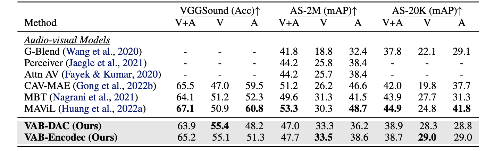
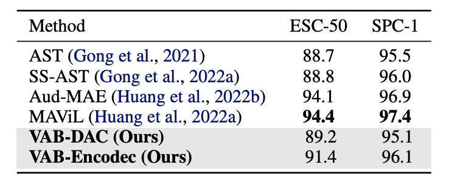

# Vision-to-Audio-and-Beyond
ICML 2024 Poster paper "From Vision to Audio and Beyond: A Unified Model for Audio-Visual Representation and Generation" ([paper](https://proceedings.mlr.press/v235/su24b.html)) ([poster](https://icml.cc/media/PosterPDFs/ICML%202024/33302.png))

## Summary
In this work, we introduce a novel framework called Vision to Audio and Beyond (VAB) to bridge the gap between audio-visual representation learning and vision-to-audio generation. The key approach of VAB is that rather than
working with raw video frames and audio data, VAB performs representation learning and generative modeling within latent spaces. VAB uses a pre-trained audio tokenizer and an image encoder to obtain audio tokens and visual features, respectively. It then performs the pretraining task of visual-conditioned masked audio token prediction. This training strategy enables the model to engage in contextual learning and simultaneous video-to-audio generation. After the pre-training phase, VAB employs the iterative decoding approach to rapidly generate audio tokens conditioned on visual features. Since VAB is
a unified model, its backbone can be fine-tuned for various audio-visual downstream tasks. Our experiments showcase the efficiency of VAB in producing high-quality audio from video, and its capability to acquire semantic audio-visual features, leading to competitive results in audio-visual retrieval and classification.


## Method

### Stage 1: Pretraining Phase
VAB first converts raw audio and visual signals into latent spaces through the utilization of a pre-trained audio neural codec and image encoder. VAB utilizes self-supervised pre-training stage centered around masked audio token prediction conditioned on visual features. At this stage VAB establishes its representation and learns to generate audio for video. 


### Stage 2: Task-specific Finetuning Stage
After VAB pre-training, the learned representation is amenable for adaptation to a variety of audio-visual tasks through fine-tuning. We therefore proceed to fine-tune the first N1 modal-specific layers of the VAB model using the contrastive loss, aiming to align audio and visual modalities for retrieval tasks. Upon contrastive finetuning, further adaptation could be applied to additional tasks, for example, classification.


## Experimnets and Results

### Zero-shot Video-to-Audio Generation
We evaluated video-to-audio generation using VGGSound test set, comparing our models against existing baselines: SpecVQGAN (Iashin & Rahtu, 2021), IM2WAV (Sheffer & Adi,
2023), Diff-Foley (Luo et al., 2023), and FoleyGen (Mei et al., 2023). With the masked audio tokens prediction task and iterative-decoding approach, VAB achieved significantly, of order of magnitude, faster inference speeds
compared to all previous works. While both FAD and KLD scores are both slightly lower than the best approaches, VAB achieves a more balanced performance in both metrics.

 

### Audio-Visual Retrieval
We assess the learned representations of VAB model for both audio-to-visual retrieval and visual-to-audio retrieval. We first fine-tune
the VAB model using the contrastive loss, employing the same training dataset utilized during the pre-training phase. To evaluate the retrieval performance, we adopt the CAVMAE (Gong et al., 2022b) methodology for conducting retrieval on audio-visual samples sourced from the AudioSet and VGGSound evaluation set. Furthermore, we extend our evaluation to include zero-shot retrieval on MSR-VTT (Xu et al., 2016) test set. 

 

### Classification
We evaluate the quality of VAB representations in the context of audio-visual event classification task. To accomplish this,
we employ the contrastive VAB model and fine-tune it on three distinct datasets: 1) AudioSet-20K, 2) AudioSet-2M, and 3) VGGSound.

 

To assess the generalization of the acquired audio representations, we further evaluate the pre-trained VAB model by transferring it to other speechonly or audio-only tasks outside its original domain.
conduct experiments on the Environmental Sound Classification (ESC-50) (Piczak, 2015) and Speech Commands (SPCv1) (Warden, 2018) datasets. In these experiments, only the audio branch of VAB is fine-tuned.

 


For more experiments and ablation studies, please refer to our paper. For more questions regarding the paper and implementations, Please reach out to the email at xl1995@uw.edu. 

## Citation

If you find our research useful for your works, please cite the [From Vision to Audio and Beyond: A Unified Model for Audio-Visual
Representation and Generation](https://raw.githubusercontent.com/mlresearch/v235/main/assets/su24b/su24b.pdf)
```

@InProceedings{pmlr-v235-su24b,
  title = 	 {From Vision to Audio and Beyond: A Unified Model for Audio-Visual Representation and Generation},
  author =       {Su, Kun and Liu, Xiulong and Shlizerman, Eli},
  booktitle = 	 {Proceedings of the 41st International Conference on Machine Learning},
  pages = 	 {46804--46822},
  year = 	 {2024},
  editor = 	 {Salakhutdinov, Ruslan and Kolter, Zico and Heller, Katherine and Weller, Adrian and Oliver, Nuria and Scarlett, Jonathan and Berkenkamp, Felix},
  volume = 	 {235},
  series = 	 {Proceedings of Machine Learning Research},
  month = 	 {21--27 Jul},
  publisher =    {PMLR},
  pdf = 	 {https://raw.githubusercontent.com/mlresearch/v235/main/assets/su24b/su24b.pdf},
  url = 	 {https://proceedings.mlr.press/v235/su24b.html},
}

```


